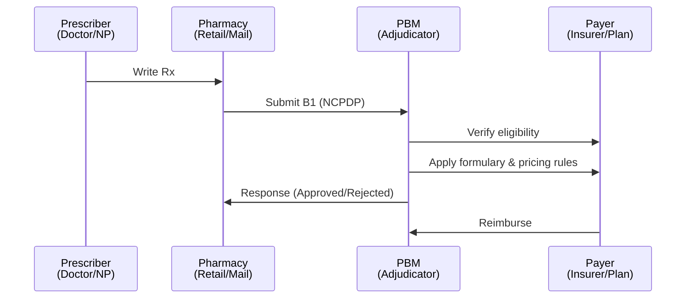

# Healthcare Industry Context

Understanding the NCPDP telecom format is easier when you know where it fits in the broader healthcare system. This page provides that context.

## The Healthcare Industry at a Glance

The healthcare industry (also called the medical industry or health economy) is an aggregation of sectors that provide goods and services for curative, preventive, rehabilitative, and palliative care. It is one of the world's largest and fastest-growing industries, consuming over 10% of gross domestic product (GDP) in most developed nations.

In the United States alone, healthcare spending reached $4.3 trillion in 2021 — approximately $12,914 per person — accounting for 18.3% of GDP. This makes healthcare an enormous part of the economy and a critical domain for data interchange standards like NCPDP.

## Industry Segments

The healthcare industry is typically divided into several areas. Using the United Nations International Standard Industrial Classification (ISIC) framework:

1. **Hospital activities** — inpatient and outpatient care delivered by hospitals
2. **Medical and dental practice activities** — office-based physicians, dentists, and other practitioners
3. **Other human health activities** — nursing, midwifery, physiotherapy, diagnostic laboratories, pathology clinics, residential health facilities, and allied health professions

The Global Industry Classification Standard (GICS) and Industry Classification Benchmark (ICB) further distinguish the industry into two main groups:

- **Healthcare equipment and services** — medical equipment, supplies, hospitals, home healthcare providers, and nursing homes
- **Pharmaceuticals, biotechnology, and related life sciences** — drug manufacturing, biotech research, and scientific services

The NCPDP telecom format operates primarily in the **pharmaceuticals and services** intersection — specifically, the electronic exchange of prescription drug claims between pharmacies and Pharmacy Benefit Managers (PBMs).

## The Pharmacy Claims Pipeline

The NCPDP telecom format exists within a specific part of the healthcare system: the **pharmacy claims pipeline**. Here is how a prescription flows through that pipeline:

### Key Participants

| Participant | Role | NCPDP Connection |
|-------------|------|-------------------|
| **Prescriber** | Writes the prescription; may query benefit information via RTPBI | RTPBI request initiator |
| **Pharmacy** | Fills the prescription and submits the claim | B1 claim submitter |
| **PBM** | Adjudicates the claim — verifies eligibility, applies formulary, calculates reimbursement | Claim adjudicator; returns NCPDP response |
| **Payer** | Health plan sponsor (insurer, employer, government program) that ultimately pays | Identified by BIN, group, and plan fields in the claim |
| **Patient** | Receives the medication and pays cost-sharing (copay, coinsurance) | Identified by cardholder/patient fields in the claim |

### Where NCPDP Fits

NCPDP standards address three points in this pipeline:

1. **RTPBI** (Real-Time Pharmacy Benefit Inquiry) — Prescriber queries the PBM before writing a prescription. See [Real-Time Pharmacy Benefit Inquiry](rtpbi.md).
2. **B1 Claim** — Pharmacy submits a claim to the PBM after filling a prescription. See [Transactions](transactions.md).
3. **B2 Reversal** — Pharmacy reverses a previously submitted claim. See [Transactions](transactions.md).

## Health System Models and NCPDP

Healthcare systems around the world differ in how they finance and deliver care. The four commonly recognized models are:

| Model | How It Works | Examples | Relevance to NCPDP |
|-------|-------------|----------|---------------------|
| **Beveridge** | Government finances and provides care via taxation; government owns facilities | UK (NHS), Cuba, New Zealand | Government acts as single payer; drug benefits may be integrated into national formularies rather than adjudicated by PBMs |
| **Bismarck** | Government-mandated, non-profit insurance funded by employers and employees; private providers | Germany, France, Japan, Belgium | Closest analogue to the U.S. PBM model — insurers (sickness funds) adjudicate claims, similar to how PBMs process NCPDP transactions |
| **National Health Insurance** | Private providers, government single-payer insurance | Canada, Taiwan, South Korea | Government insurer processes claims centrally; NCPDP-style standards may be replaced by national claims systems |
| **Out-of-Pocket** | Patients pay directly; no organized insurance mechanism | Many developing nations | No intermediary adjudication; NCPDP is not applicable because there is no PBM to receive the claim |

The NCPDP telecom format is most relevant in systems that use **intermediaries** (PBMs, insurers, or sickness funds) to adjudicate pharmacy claims — primarily the Bismarck and National Health Insurance models, and the U.S. hybrid system.

## The U.S. System and PBMs

The United States uses a **multi-payer, market-based system** — there is no single national health insurance program. Instead, coverage comes from a patchwork of public programs (Medicare, Medicaid, CHIP) and private insurance (employer-sponsored, individually purchased). Pharmacy benefits across nearly all of these programs are managed by PBMs, which is why NCPDP is so widely used in the U.S.

The key coverage sources, and how each connects to NCPDP:

- **Employer-sponsored insurance** — The largest source of health coverage in the U.S., covering roughly half the population; employers contract with PBMs to manage prescription drug benefits
- **Medicare Part D** — Federal prescription drug benefit for seniors and disabled individuals; PBMs administer Part D plans
- **Medicaid** — State-federal program for low-income individuals; states contract with PBMs for pharmacy benefit management
- **ACA Health Insurance Marketplaces** — Individually purchased plans sold on federal and state exchanges; these plans include pharmacy benefits adjudicated by PBMs
- **Federal Employees Health Benefits Program (FEHBP)** — Health insurance for federal employees; PBMs manage the pharmacy benefit
- **TRICARE** — Health care program for uniformed service members, retirees, and their families; pharmacy claims processed through NCPDP
- **Health Maintenance Organizations (HMOs)** — Capitated managed care plans that sponsor pharmacy benefits; their gatekeeper model and narrow formularies directly shape NCPDP claims. See [Health Maintenance Organizations](hmos.md).

For a detailed explanation of PBM functions, market structure, and regulation, see [Pharmacy Benefit Managers](pbms.md).

## Public Health Insurance Programs

The U.S. has several large public insurance programs. Each one is a major source of pharmacy claims that flow through the NCPDP standard.

### Medicare

Medicare is the federal health insurance program for people aged 65 and older, certain younger people with disabilities, and people with end-stage renal disease (ESRD) or ALS. It consists of four parts:

| Part | Name | Coverage | NCPDP Relevance |
|------|------|----------|-----------------|
| **A** | Hospital Insurance | Inpatient hospital stays, skilled nursing, hospice | Indirect — Part A does not cover outpatient prescriptions |
| **B** | Medical Insurance | Doctor visits, outpatient care, preventive services, some physician-administered drugs | Physician-administered drugs (e.g., infusions) are billed under Part B, not through the pharmacy claims pipeline |
| **C** | Medicare Advantage | Private plans that combine Parts A and B, often including Part D | Plans are administered by insurers who contract with PBMs; all pharmacy claims use NCPDP |
| **D** | Prescription Drug Coverage | Outpatient prescription drugs | **Primary NCPDP connection** — all Part D pharmacy claims are transmitted using NCPDP |

**Medicare Part D** is the most significant public program for NCPDP. Created by the Medicare Prescription Drug, Improvement, and Modernization Act of 2003, Part D provides prescription drug coverage to over 50 million beneficiaries. Key features:

- Plans are offered by private insurers and administered by PBMs
- Formularies must include at least two drugs in each therapeutic category, but specific drugs and tier placements vary by plan
- Coverage includes a deductible phase, initial coverage phase, a coverage gap ("donut hole"), and catastrophic coverage
- All Part D pharmacy claims — including retail, mail-order, and long-term care — are transmitted using NCPDP

The NCPDP BIN number on a pharmacy claim often routes directly to a Part D plan's PBM. Fields like the plan ID (`C9`/`FO`) and group ID (`C1`) identify the specific Part D plan within the PBM's system.

### Medicaid

Medicaid is a joint federal-state program that provides health coverage to low-income individuals and families. Each state administers its own Medicaid program within federal guidelines, which means pharmacy benefits vary significantly by state.

Key NCPDP connections:

- States contract with PBMs (or operate their own claims processing systems) to manage Medicaid pharmacy benefits
- Medicaid pharmacy claims use the same NCPDP transaction types (B1, B2) as commercial claims
- Medicaid-specific fields in NCPDP include the **Medicaid ID number** and **submission clarification codes** that indicate whether the claim is a Medicaid primary or secondary payer
- States may impose additional requirements such as preferred drug lists, step therapy, and mandatory generic substitution — all of which are enforced through PBM adjudication rules applied to NCPDP claims

### Children's Health Insurance Program (CHIP)

CHIP provides health coverage to children in families with incomes too high to qualify for Medicaid but too low to afford private insurance. Like Medicaid, CHIP is administered by states and may be structured as a separate program, combined with Medicaid, or both.

From an NCPDP perspective, CHIP claims are generally processed through the same state Medicaid claims systems and PBM contracts.

### TRICARE and Military Health Benefits

TRICARE provides health care for uniformed service members, retirees, and their families. The Department of Defense contracts with private insurers to administer TRICARE, and pharmacy benefits are managed through a PBM. TRICARE pharmacy claims use NCPDP transactions.

The Veterans Health Administration (VA) operates its own pharmacy system for veterans and does not typically use the commercial NCPDP pipeline — the VA dispenses medications directly from VA pharmacies.

### Indian Health Service (IHS)

The IHS provides health care to eligible American Indians and Alaska Natives. IHS pharmacies dispense medications directly, but when IHS-eligible patients use non-IHS pharmacies, claims may be submitted through NCPDP to the appropriate payer (Medicaid, Medicare, or private insurance).

## Private Health Insurance

Private health insurance covers the majority of Americans with health coverage. Understanding the different types is important for NCPDP because each type generates pharmacy claims that flow through the standard, but with different rules, formularies, and cost-sharing structures.

### Employer-Sponsored Insurance

Employer-sponsored insurance is the largest source of health coverage in the U.S., covering approximately 150 million people. Employers may:

- **Self-insure** — The employer pays claims directly and hires a PBM to administer the pharmacy benefit. Self-insured plans are regulated under federal law (ERISA) rather than state law, giving them more flexibility in plan design.
- **Fully insure** — The employer purchases a policy from a health insurer, which then contracts with a PBM for pharmacy benefits. These plans are subject to state insurance regulations.

From an NCPDP perspective, both types generate B1 claims that are adjudicated by PBMs. The key difference is that self-insured plans may have custom formularies and unique cost-sharing structures, while fully insured plans follow the insurer's standard benefit design.

### ACA Health Insurance Marketplaces

The Affordable Care Act (2010) created Health Insurance Marketplaces (also called Exchanges) where individuals and small businesses can purchase health insurance. Marketplace plans are required to cover **essential health benefits**, which include prescription drugs.

Marketplace plans are offered by private insurers and administered by PBMs. Pharmacy claims from Marketplace plans use the same NCPDP transactions as commercial employer-sponsored plans.

### Individually Purchased Insurance

Outside the Marketplaces, individuals may purchase insurance directly from insurers. These plans are also subject to ACA regulations — they must cover essential health benefits (including prescription drugs), cannot deny coverage for pre-existing conditions, and cannot impose annual or lifetime limits on essential benefits.

### COBRA Coverage

The Consolidated Omnibus Budget Reconciliation Act (COBRA) gives workers and their families the right to continue employer-sponsored coverage for a limited time after job loss, reduction in hours, or other qualifying events. COBRA beneficiaries remain on the same plan with the same PBM, so NCPDP claims continue unchanged — only the payer changes.

## Insurance Plan Types and Pharmacy Benefits

Within both public and private insurance, there are several plan types that affect how pharmacy benefits work — and therefore how NCPDP claims are adjudicated.

| Plan Type | Pharmacy Network | Cost-Sharing | Formulary | NCPDP Impact |
|-----------|-----------------|--------------|-----------|-------------|
| **Fee-for-Service / Indemnity** | Broad or no network | Higher premiums, lower restrictions | Often open | Claims processed with fewer restrictions; PBM role is primarily reimbursement |
| **Health Maintenance Organization (HMO)** | Restricted network | Lower premiums, higher restrictions | Closed formulary | PBM enforces network restrictions; out-of-network pharmacies may not be covered |
| **Preferred Provider Organization (PPO)** | Broad network with tiers | Moderate premiums, tiered cost-sharing | Tiered formulary | PBM adjudicates based on in-network vs. out-of-network status and formulary tier |
| **Exclusive Provider Organization (EPO)** | No out-of-network coverage | Lower premiums than PPO | Managed formulary | PBM rejects claims from out-of-network pharmacies entirely |
| **Point of Service (POS)** | Hybrid (HMO + out-of-network option) | Moderate | Managed formulary | Similar to HMO but with out-of-network option at higher cost |
| **High-Deductible Health Plan (HDHP) with HSA** | Varies (often PPO-style) | Low premiums, high deductible | Varies | Claims may be adjudicated but patient pays full cost until deductible is met; NCPDP pricing fields reflect the deductible status |

### How Plan Type Affects NCPDP Claims

The plan type determines several aspects of claim adjudication:

1. **Eligibility verification** — HMO and EPO plans may reject claims from out-of-network pharmacies entirely; PPO and indemnity plans may pay at a reduced rate
2. **Formulary enforcement** — Closed formularies (HMO, EPO) may reject non-formulary drugs outright; tiered formularies (PPO) apply different cost-sharing levels
3. **Prior authorization** — More restrictive plans (HMO, EPO) tend to require prior authorization more frequently, which appears in NCPDP reject codes and the RTPBI use case for prior authorization
4. **Cost-sharing calculation** — The PBM calculates patient copay, coinsurance, and deductible amounts based on the plan type and formulary tier, and returns these in the NCPDP response pricing fields

## Key Insurance Concepts for NCPDP

Understanding insurance terminology is essential for working with NCPDP data. Many NCPDP fields exist specifically to carry insurance-related information between the pharmacy and the PBM.

### Deductible

A **deductible** is the amount a patient must pay out of pocket before insurance begins to cover costs. In NCPDP claims, the deductible status of a patient affects the pricing fields in the response — the PBM calculates how much of the deductible has been met and returns the patient's remaining responsibility.

### Copayment and Coinsurance

- **Copayment** (copay) — A fixed amount the patient pays for a covered prescription (e.g., "$10 for a generic drug")
- **Coinsurance** — A percentage of the drug's cost that the patient pays (e.g., "20% of the drug price")

NCPDP uses specific fields to communicate cost-sharing amounts between the pharmacy and the PBM. The **patient-paid amount** field in the claim indicates what the patient paid at the point of sale, and the response may adjust this based on the plan's copay or coinsurance rules.

### Formulary and Tiers

A **formulary** is a list of drugs covered by a health plan, typically organized into tiers with different cost-sharing levels. Formularies are central to PBM adjudication of NCPDP claims:

- When a pharmacy submits a B1 claim, the PBM checks the drug's NDC code against the plan's formulary
- The formulary tier determines the patient's copay or coinsurance
- Non-formulary drugs may be rejected, require prior authorization, or be covered at the highest cost-sharing tier

See [Pharmacy Benefit Managers](pbms.md) for more detail on formulary tiers.

### Prior Authorization

**Prior authorization** (PA) is a requirement that the prescriber obtain approval from the health plan before a specific drug is covered. When a PBM receives a claim for a drug that requires PA, it rejects the claim with a specific reject code, and the pharmacy must obtain authorization before resubmitting.

In the NCPDP standard, prior authorization is communicated through:
- The **prior authorization number** field (when PA has been obtained)
- **Reject codes** in the response (when PA is required but not yet obtained)

In the RTPBI standard, prior authorization is **Use Case 7** — the PBM informs the prescriber that PA is required, enabling the prescriber to initiate electronic prior authorization (ePA) before the prescription reaches the pharmacy. See [Real-Time Pharmacy Benefit Inquiry](rtpbi.md).

### Step Therapy

**Step therapy** (also called "fail first") is a requirement that a patient try one or more lower-cost drugs before the plan will cover a more expensive drug. Like prior authorization, step therapy is enforced through PBM adjudication:

- The PBM rejects the claim for the preferred drug with a reject code indicating step therapy is required
- The claim may include the drugs that must be tried first
- In the RTPBI standard, this is **Use Case 6**

### Coordination of Benefits

**Coordination of benefits** (COB) occurs when a patient has more than one insurance plan — for example, coverage through both a spouse's employer plan and their own employer plan. In NCPDP claims:

- The **other coverage code** (field `C8`) tells the PBM whether the patient has other coverage and the order in which plans should be billed
- The PBM uses this information to determine which plan is primary and which is secondary
- The secondary plan may cover the patient's remaining cost-sharing after the primary plan has paid

### Out-of-Pocket Maximum

An **out-of-pocket maximum** (OOP max) is the most a patient pays during a policy period (usually one year) before the health plan begins to pay 100% of covered costs. When a patient has reached their OOP max, the PBM response reflects a $0 patient cost-sharing amount.

## Key Legislation Affecting Pharmacy Claims

Several federal laws have shaped how pharmacy claims work in the U.S. and how the NCPDP standard is used:

| Law | Year | Key Provisions | NCPDP Impact |
|-----|------|----------------|--------------|
| **Health Insurance Portability and Accountability Act (HIPAA)** | 1996 | Established national standards for electronic health care transactions and privacy | **Mandates the NCPDP telecom standard for pharmacy drug claim submission**; NCPDP is the required transaction standard under HIPAA |
| **Medicare Prescription Drug, Improvement, and Modernization Act (MMA)** | 2003 | Created Medicare Part D — the federal prescription drug benefit for seniors and disabled individuals | Part D plans are administered by PBMs and process all pharmacy claims through NCPDP; created the largest single source of NCPDP transactions |
| **Affordable Care Act (ACA)** | 2010 | Expanded health coverage, required essential health benefits (including prescription drugs), created Health Insurance Marketplaces | All Marketplace plans must cover prescription drugs; expanded coverage means more insured patients generating more NCPDP claims; prohibited pre-existing condition exclusions |
| **Patient Right to Know Drug Prices Act** | 2018 | Prohibited gag clauses that prevented pharmacists from telling patients about cheaper cash prices | Directly affects the pharmacy-PBM relationship; pharmacists can now inform patients about lower-cost options |
| **Know the Lowest Price Act** | 2018 | Prohibited Medicare and Medicare Advantage plans from restricting pharmacists from disclosing cash prices | Same as above, specifically for Medicare plans |
| **Consolidated Appropriations Act** | 2026 | Requires PBMs to pass through 100% of rebates to employer plans; adds transparency requirements; shifts Medicare PBM reimbursement to flat-fee model (starting 2028) | Will change how PBMs report pricing in NCPDP response fields; may affect ingredient cost and dispensing fee fields |

### HIPAA's NCPDP Mandate

HIPAA's significance for NCPDP cannot be overstated. The law's Administrative Simplification provisions require that covered entities (health plans, health care clearinghouses, and health care providers who conduct electronic transactions) use standard transaction formats for electronic health care transactions. For pharmacy claims, the designated standard is the NCPDP telecom format.

This means that virtually every electronic pharmacy claim in the U.S. — whether commercial, Medicare Part D, or Medicaid — must use the NCPDP standard. This federal mandate is the primary reason for the standard's widespread adoption.

## Healthcare Spending and Pharmacy Claims

Pharmaceutical spending is a significant and growing share of healthcare costs. In OECD countries, per capita spending on health and pharmaceuticals has grown from a few hundred dollars in the 1970s to an average of approximately US$4,000 per year (in purchasing power parity terms).

In the U.S.:

- Prescription drug spending accounts for roughly 10% of total national health expenditures
- The pharmacy claims pipeline — from prescriber to pharmacy to PBM to payer — processes billions of transactions annually
- Each transaction in this pipeline uses the NCPDP telecom format

This scale is why a standardized, efficient format for pharmacy claims is critical. Every field in an NCPDP transaction exists because it carries information that one of the participants in this pipeline needs to make a decision: Is this patient covered? Is this drug on the formulary? How much will the payer reimburse? How much will the patient pay?

## The Healthcare Workforce Behind the Claims

The World Health Organization estimates there are 9.2 million physicians, 19.4 million nurses and midwives, 1.9 million dentists, 2.6 million pharmacists, and over 1.3 million community health workers worldwide. In the U.S. alone, the healthcare sector is the largest employer.

Behind every NCPDP transaction, there are people:

- **Pharmacists** who submit and adjudicate claims
- **Pharmacy technicians** who process prescriptions
- **PBM adjudicators** who build and maintain the formulary and pricing rules
- **Health informatics professionals** who integrate NCPDP data into clinical and billing systems
- **Administrators** who manage revenue cycle operations

The NCPDP standard is the technical layer that connects these participants, enabling pharmacy claims to be processed in seconds rather than days.

## Telehealth and the Future

The healthcare industry is increasingly adopting telehealth and digital communication — remote consultations, e-prescribing, electronic prior authorization, and real-time benefit inquiries. These trends directly affect NCPDP:

- **Real-Time Pharmacy Benefit Inquiry (RTPBI)** enables prescribers to check coverage at the point of care, before a prescription is written. See [Real-Time Pharmacy Benefit Inquiry](rtpbi.md).
- **Electronic prior authorization (ePA)** allows prescribers to submit prior authorization requests electronically, reducing delays.
- **Telehealth** expands the number of prescriptions written remotely, which then flow through the same NCPDP claims pipeline.

As healthcare delivery evolves, the NCPDP standard continues to adapt — adding transaction types (like RTPBI) and data elements to support new workflows while maintaining backward compatibility with the core request-response model.

---

*Sources: [Healthcare industry — Wikipedia](https://en.wikipedia.org/wiki/Healthcare_industry); [Pharmacy benefit management — Wikipedia](https://en.wikipedia.org/wiki/Pharmacy_benefit_management); [Health insurance in the United States — Wikipedia](https://en.wikipedia.org/wiki/Health_insurance_in_the_United_States)*