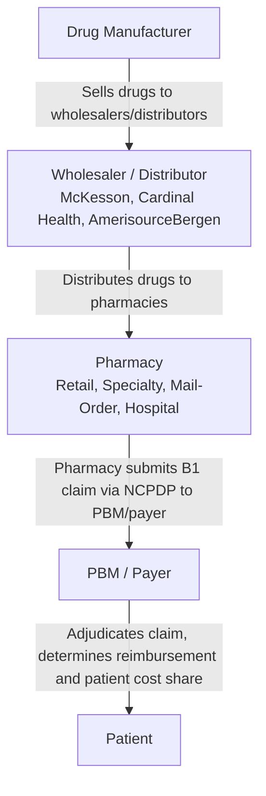

# Pharmaceutical Industry Context

NCPDP transactions don't exist in a vacuum — they carry data through a complex supply chain governed by regulation, pricing dynamics, and industry structure. Understanding the pharmaceutical industry context makes it clearer why certain NCPDP fields exist and what they mean.

## The Drug Supply Chain

A prescription drug passes through several hands before reaching a patient, and each handoff is a point where data — often transmitted via NCPDP — changes hands:

The NCPDP telecom standard operates primarily at the **pharmacy-to-PBM** handoff in this chain. Every B1 claim is a pharmacy asking a PBM: *will this prescription be covered, and how much will be paid?*

### Key Stakeholders

| Stakeholder | Role | NCPDP Relevance |
|-------------|------|-----------------|
| **Drug manufacturers** | Discover, develop, produce, and market drugs. Set the list price ( Wholesale Acquisition Cost). | NDC codes in NCPDP identify specific manufacturer products |
| **Wholesalers / distributors** | Buy drugs from manufacturers in bulk and distribute to pharmacies. The "Big Three" (McKesson, Cardinal Health, AmerisourceBergen) handle ~90% of U.S. drug distribution. | Indirect — pharmacies acquire inventory from wholesalers, and the cost basis flows into NCPDP pricing fields |
| **Pharmacies** | Fill prescriptions and dispense drugs to patients. Submit claims to PBMs via NCPDP. | Direct — the pharmacy is the NCPDP claim submitter |
| **PBMs** | Adjudicate claims, manage formularies, negotiate rebates, set reimbursement rates. See [Pharmacy Benefit Managers](pbms.md). | Direct — the PBM is the NCPDP claim receiver and responder |
| **Health plan sponsors** | Employers, insurers, and government programs (Medicare, Medicaid) that pay for drug benefits. | BIN and group numbers in NCPDP identify the plan sponsor's benefit |
| **Patients** | Receive prescribed medications and pay cost-sharing (copay, coinsurance, deductible). | Patient demographics and cost-sharing fields in NCPDP |

## Drug Approval and Identification

### FDA Approval

Before a drug can be prescribed — and therefore before it can appear in an NCPDP claim — it must be approved by the U.S. Food and Drug Administration (FDA). The approval process involves:

1. **Preclinical research** — Laboratory and animal studies to assess safety and biological activity
2. **Investigational New Drug (IND) application** — The manufacturer submits data to the FDA to begin clinical trials
3. **Clinical trials** — Phases I (safety), II (efficacy), and III (large-scale safety and efficacy)
4. **New Drug Application (NDA) or Biologics License Application (BLA)** — The manufacturer submits all data for FDA review
5. **FDA review and approval** — The FDA evaluates safety, efficacy, and manufacturing quality

The entire process typically takes 10–15 years and costs an estimated $1–2 billion per approved drug.

### National Drug Code (NDC)

Upon FDA approval, each drug product is assigned a **National Drug Code (NDC)** — a unique 10- or 11-digit identifier that encodes the labeler (manufacturer), product, and package size. The NDC is the primary way drugs are identified in NCPDP transactions:

| NDC Component | Digits | Identifies |
|---------------|--------|------------|
| Labeler code | 4–5 | The manufacturer or distributor |
| Product code | 3–4 | The specific drug product (strength, dosage form) |
| Package code | 1–2 | The package size and type |

In NCPDP, the NDC appears in the **Product/Service ID** field (field `E1`/`D7`), qualified by the Product/Service ID Qualifier (field `E7`), which indicates that the ID is an NDC code.

A single drug can have many NDCs — one for each manufacturer, strength, dosage form, and package size. This is why NCPDP uses a **product/service ID qualifier** field: it tells the PBM what kind of identifier follows.

### Generic Drugs and Therapeutic Equivalents

When a brand-name drug's patent expires, other manufacturers can produce **generic** versions that contain the same active ingredient in the same strength and dosage form. The FDA assigns **therapeutic equivalence** codes to generics:

- **A-rated** drugs are considered therapeutically equivalent to the reference product
- **B-rated** drugs are not considered equivalent (different bioavailability, etc.)

This distinction is central to PBM formulary design and directly affects NCPDP claims:
- The **Dispense as Written (DAW)** field (field `D8`) indicates whether the prescriber or patient requires a brand-name product instead of a generic
- The **Other Coverage Code** field (field `C8`) can indicate coordination of benefits scenarios involving generic substitution
- PBM reimbursement rates are typically based on generic cost when available, unless a DAW code overrides this

## Patents and Generics

### How Drug Patents Work

Drug manufacturers obtain patents to protect their investment in research and development. A typical new drug receives:

- **Composition of matter patents** — Cover the chemical compound itself (20-year term from filing, but effective market exclusivity is typically 5–12 years after approval due to the lengthy clinical trial process)
- **Method-of-use patents** — Cover specific therapeutic uses
- **Formulation patents** — Cover specific dosage forms or delivery mechanisms

During patent protection, the manufacturer holds a monopoly on the drug and sets the list price. This period is critical for recouping R&D investment, which the pharmaceutical industry estimates at $1–2 billion per approved drug (including the cost of failed candidates).

### The Hatch-Waxman Act

The **Drug Price Competition and Patent Term Restoration Act of 1984** (Hatch-Waxman Act) established the modern framework for generic drug approval in the United States:

- It created the **Abbreviated New Drug Application (ANDA)** pathway, allowing generic manufacturers to gain approval by demonstrating bioequivalence without repeating full clinical trials
- It provided **patent term restoration** to compensate brand manufacturers for the regulatory review period
- It established the **Orange Book**, which lists approved drugs and their patent and exclusivity status

### Impact on NCPDP Claims

The brand-to-generic lifecycle directly shapes NCPDP fields and PBM adjudication logic:

| Stage | PBM Behavior | NCPDP Impact |
|-------|--------------|--------------|
| Brand under patent | Brand drug is the only option; high cost | Claim uses brand NDC; pricing at brand WAC |
| Patent challenge / first generic | PBM may encourage generic substitution | DAW field becomes relevant; generic NDCs appear |
| Multiple generics available | PBM mandates generic substitution | Claims must use generic NDC; reimbursement shifts to generic cost benchmarks |
| Brand discontinued | Remaining brand stock may still be claimed | NDC still valid; PBM may apply brand pricing rules |

## Drug Pricing

Pharmaceutical pricing in the United States involves multiple price points and intermediaries. Understanding these is essential for interpreting NCPDP pricing fields.

### Key Price Benchmarks

| Benchmark | Definition | Typical Relationship |
|-----------|-----------|---------------------|
| **WAC** (Wholesale Acquisition Cost) | The manufacturer's list price to wholesalers; akin to a "sticker price" | Starting point; actual transaction prices are usually lower |
| **AMP** (Average Manufacturer Price) | The average price paid by wholesalers to manufacturers, net of rebates and discounts | Below WAC; reported to Medicaid |
| **340B Price** | Discounted price for eligible safety-net providers | Significantly below WAC (statutorily capped) |
| **NADAC** (National Average Drug Acquisition Cost) | The average price pharmacies pay to acquire a drug | Based on survey data; used for Medicaid reimbursement |
| **AUC** (Average Unit Cost) | The PBM's actual cost for a drug unit | Proprietary; varies by contract |

### What Appears in NCPDP Claims

NCPDP includes several pricing fields that capture what the pharmacy charges and what the PBM reimburses:

| NCPDP Field | Code | Description |
|-------------|------|-------------|
| Ingredient Cost Submitted | `D9` | The pharmacy's cost for the drug ingredient(s) |
| Dispensing Fee Submitted | `DC` | The pharmacy's fee for dispensing the prescription |
| Patient Paid Amount Submitted | `DX` | What the patient pays at the counter (copay, coinsurance) |
| Usual and Customary Charge | `DQ` | The pharmacy's retail price for a cash-paying customer |
| Gross Amount Due | `DU` | Total amount the pharmacy is claiming |
| Basis of Cost Determination | `DN` | Code indicating how the ingredient cost was determined (e.g., WAC, AWP, MAC) |

The **Basis of Cost Determination** field (`DN`) is particularly important — it tells the PBM what pricing benchmark the pharmacy used, which affects how the PBM calculates reimbursement.

### Manufacturer Rebates

Drug manufacturers pay **rebates** to PBMs (and through them, to plan sponsors) in exchange for favorable formulary placement. Rebates are typically calculated as a percentage of WAC and may be:

- **Volume-based** — Higher volume triggers higher rebate percentages
- **Market-share-based** — The manufacturer guarantees rebates if their product captures a certain share of the market
- **Inflation-based** — If the manufacturer raises WAC faster than inflation, they owe an additional rebate (required by Medicaid)

Rebates do not appear directly in NCPDP claims — they are settled between manufacturers and PBMs outside the claims process. However, they influence formulary design, which determines whether a drug is covered and at what tier, which directly affects the adjudication response.

## The Regulatory Environment

### HIPAA and the NCPDP Mandate

The **Health Insurance Portability and Accountability Act of 1996** (HIPAA) requires the use of standardized electronic transactions for healthcare claims. For pharmacy claims, HIPAA specifically mandates the **NCPDP telecom standard** (and the related batch standard) for:

- Retail pharmacy claims (B1 transactions)
- Pharmacy claim reversals (B2 transactions)

This mandate is why NCPDP is not optional — if you submit pharmacy claims electronically in the United States, you must use NCPDP.

### Other Relevant Regulation

| Regulation | Relevance to NCPDP |
|-----------|-------------------|
| **Medicaid Drug Rebate Program** (1990) | Requires manufacturers to pay rebates to Medicaid; affects pricing fields and basis of cost determination |
| **340B Drug Pricing Program** (1992) | Provides discounted drugs to safety-net providers; claims may include 340B identifiers |
| **Medicare Part D** (2006) | Created the Part D prescription drug benefit; all Part D claims use NCPDP |
| **Drug Supply Chain Security Act** (2013) | Establishes requirements for tracing drugs through the supply chain; related to product identification in claims |
| **Know the Lowest Price Act** (2018) | Prohibits gag clauses preventing pharmacists from disclosing cash prices |
| **Patient Right to Know Drug Prices Act** (2018) | Prohibits PBM gag clauses on drug price disclosure |
| **Consolidated Appropriations Act** (2026) | Requires PBMs to pass through 100% of rebates to employer plans; adds transparency requirements |

### State Regulation

All 50 U.S. states have enacted PBM-related legislation addressing pharmacy operations, pricing transparency, licensure, and network adequacy. These state laws affect how PBMs process NCPDP claims but do not change the NCPDP format itself.

## How It All Connects

Here is how the pharmaceutical industry context maps to specific NCPDP concepts:

| Industry Concept | NCPDP Implementation |
|-----------------|---------------------|
| Drug identification (FDA approval, NDC) | Product/Service ID fields (`E1`/`D7`) and qualifier (`E7`) |
| Brand vs. generic (patents, Hatch-Waxman) | Dispense as Written field (`D8`), generic substitution logic |
| Drug pricing (WAC, AMP, rebates) | Pricing segment fields (`D9`, `DC`, `DX`, `DQ`, `DU`, `DN`) |
| PBM formulary management | Other Coverage Code (`C8`), Prior Authorization number |
| PBM adjudication | Response segment with paid/rejected status and reject codes |
| Patient cost-sharing | Patient Paid Amount (`DX`), copay/coinsurance in responses |
| Health plan identification | BIN number (`C2`), Group ID (`C1`), Plan ID (`C9`/`FO`) |
| Pharmacy identification | Service Provider ID and qualifier in the transaction header |
| Prescriber identification | Prescriber ID qualifier (`EZ`), Prescriber ID (`DB`) |
| Drug Utilization Review | DUR fields in claim and response segments |

---

*Sources: [Pharmaceutical industry — Wikipedia](https://en.wikipedia.org/wiki/Pharmaceutical_industry), [Healthcare Data Insight — NCPDP Telecom Format](https://datainsight.health/ncpdp/intro/)*