# Real-Time Pharmacy Benefit Inquiry (RTPBI)

The **Real-Time Pharmacy Benefit Inquiry** (**RTPBI**) is an NCPDP transaction standard that enables a prescriber to query a patient's prescription benefit information in real time — at the point of care, before a prescription is written.

Unlike the NCPDP telecom standard's B1 claim (which is submitted by a pharmacy after a prescription is filled), RTPBI is initiated by the prescriber during the clinical decision-making process. It answers a simple but critical question: **is this drug covered for this patient, and what will it cost?**

## Why RTPBI Exists

The NCPDP batch formulary and benefit standard already exists for EHR systems, but it has significant limitations:

- It is **not real-time** — it describes the patient's benefit plan generally, not at a specific point in time
- It is **not patient-specific** — it does not reflect the patient's actual financial responsibility or cost share
- It does not address coverage restrictions like prior authorization, step therapy, or restricted pharmacy networks

These gaps mean that when a prescriber writes a prescription, neither the prescriber nor the patient may know until they reach the pharmacy whether:

- The medication is on the formulary
- There are quantity limits or coverage restrictions
- Prior authorization is required
- The patient's cost share is manageable
- The patient is in a coverage gap (e.g., Medicare Part D)
- The pharmacy or prescriber is in-network

RTPBI closes these gaps by providing patient-specific, real-time benefit information at the point of care.

## Key Properties

| Property | Description |
|----------|-------------|
| **Initiator** | Prescriber (via EHR or e-prescribing system) |
| **Responder** | Payer / PBM / Adjudicator |
| **Routing** | Optionally through an intermediary (switch) |
| **Timing** | Real-time (response in seconds) |
| **Scope** | Patient-specific, point-in-time |
| **Purpose** | Inform prescribing decisions before a prescription is written |

### Point-in-Time Nature

RTPBI responses reflect the patient's benefit status **at the moment of the inquiry**. If the patient's coverage changes between the inquiry and when the prescription is actually filled at the pharmacy, the patient's experience may differ. This is an important assumption: RTPBI gives the prescriber a snapshot, not a guarantee.

### Request Uniformity, Response Variability

All RTPBI **requests** contain the same set of data elements — the prescriber always sends the same information regardless of which use case applies. The **response** varies depending on which of the 12 use cases (or combination of use cases) are triggered by the inquiry.

When multiple use cases apply to a single request, the response addresses all of them in a single response, rather than requiring the prescriber to submit multiple inquiries.

## Actors and Stakeholders

### Actors (Direct Participants)

| Actor | Role |
|-------|------|
| **Prescriber / Provider** | Initiates the RTPBI request from an EHR or e-prescribing system |
| **EHR / E-Prescribing System** | The software system that sends the request and displays the response |
| **Intermediary / Switch** | Optionally routes the transaction between the prescriber and the payer (not required) |
| **Payer / PBM / Adjudicator** | Processes the request and returns the response with benefit information |

### Stakeholders (Impacted Parties)

The most important stakeholder is the **patient**, whose benefit information and cost share are being queried. Other stakeholders include pharmacies, drug manufacturers, employer groups, and health plan sponsors.

## Use Cases

The RTPBI standard defines 12 use cases that cover the most common scenarios a prescriber may encounter. Each use case represents a distinct benefit situation with its own response requirements.

### Use Case 1: Patient Eligible, Product Covered (Happy Path)

The prescriber submits a request, the PBM confirms the patient is eligible, the product is on the formulary, the pharmacy is in-network, and the prescription can proceed. The response includes the patient's estimated financial responsibility (cost share).

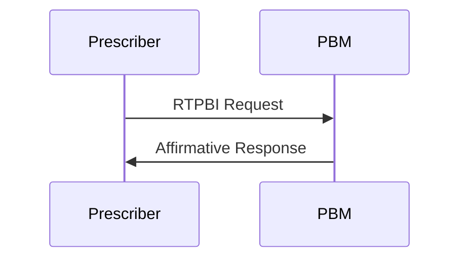

**Affirmative response includes:**
- Routing information
- Transaction-specific information
- Prescription information (echoed back)
- Estimated patient financial responsibility

### Use Case 2: Patient Not Eligible

The PBM cannot confirm the patient's eligibility. This could mean the patient is not enrolled, their coverage has lapsed, or they cannot be found in the system. No benefit or cost information is returned — only the fact that the patient is not eligible.

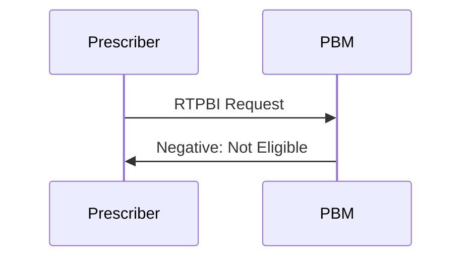

**Response:** Patient is not eligible. No financial information is provided.

### Use Case 3: Benefit Exclusion

The requested product is excluded from the patient's benefit entirely — no coverage applies, no alternatives are offered, and there is no formulary alternative pathway. Common examples include entire drug classes such as investigational drugs or fertility treatments that are contractually excluded.

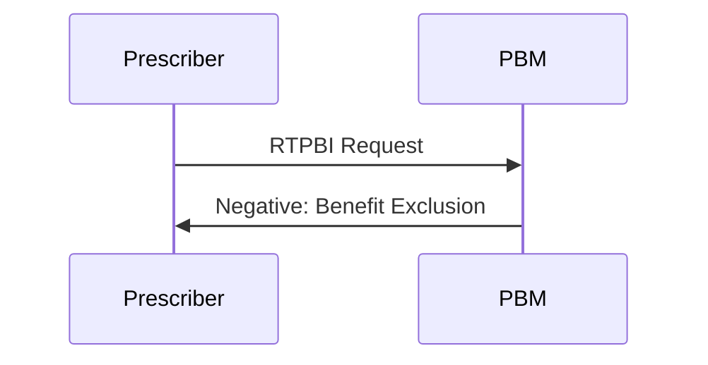

**Response:** Benefit exclusion. No financial information, no alternatives.

### Use Case 4: Formulary Exclusion

The requested product is not on the patient's formulary, but the plan may offer alternative formulary products. Unlike a benefit exclusion, the PBM can optionally return information about covered alternatives and their cost share.

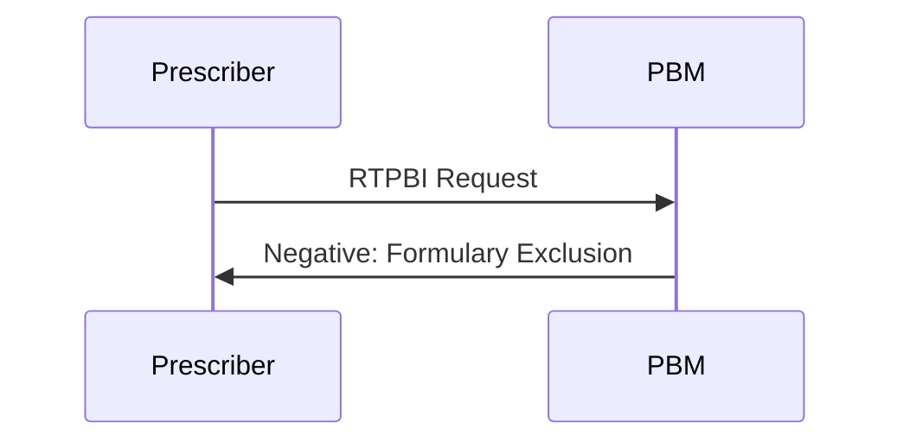

**Response (required):** Formulary exclusion indicator.

**Response (optional):** Alternative formulary products and their estimated patient financial responsibility.

### Use Case 5: Coverage Limits

The quantity or day supply requested exceeds what the plan allows, or the product has age or gender restrictions. Examples include quantity limits, age edits (pediatric or elderly risk), and gender-based edits.

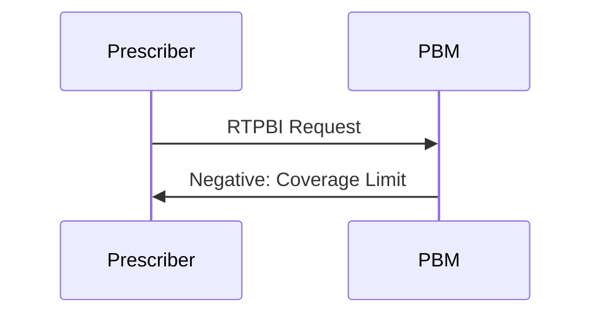

**Response:** Coverage limit indicator. The response may include the maximum quantity or day supply allowed.

### Use Case 6: Step Therapy Required

The plan requires that the patient try and fail one or more preferred drugs before the requested product is approved. The response indicates step therapy is required and may list the drugs that must be tried first.

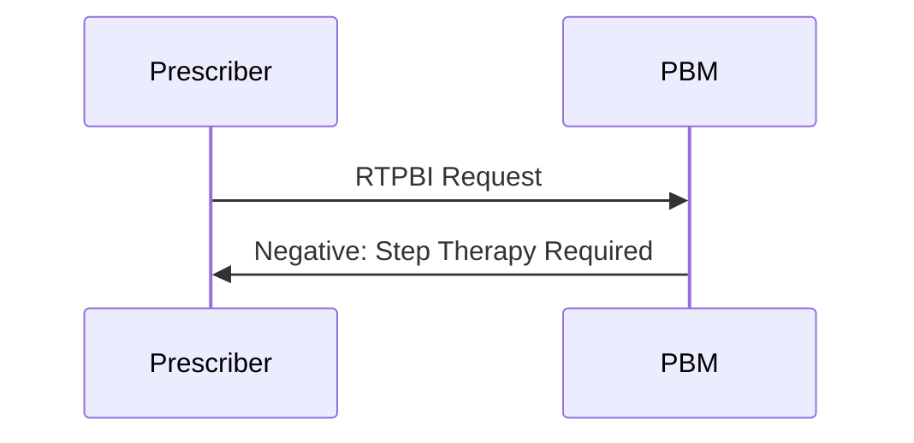

**Response:** Step therapy required indicator. Optionally, the drugs that must be tried first.

### Use Case 7: Prior Authorization Required

The plan requires prior authorization before the requested product will be covered. The intent is that the prescriber's EHR system can then initiate an electronic prior authorization (ePA) transaction as a follow-up.

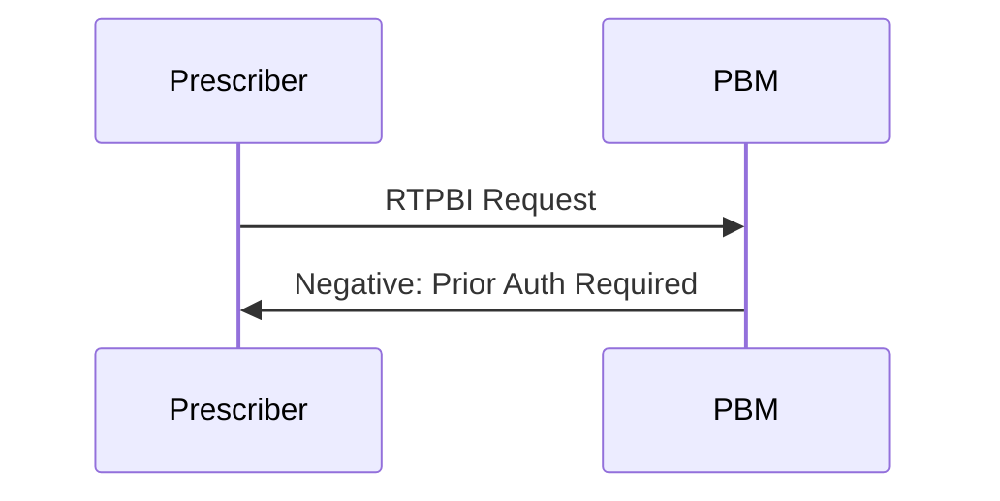

**Response:** Prior authorization required indicator.

**Workflow implication:** This use case is designed to trigger the ePA (electronic prior authorization) process, which is part of the NCPDP SCRIPT standard.

### Use Case 8: Out-of-Network Pharmacy

The pharmacy identified in the request is not in the patient's network. The prescriber is notified that the patient may have reduced or no coverage at that pharmacy.

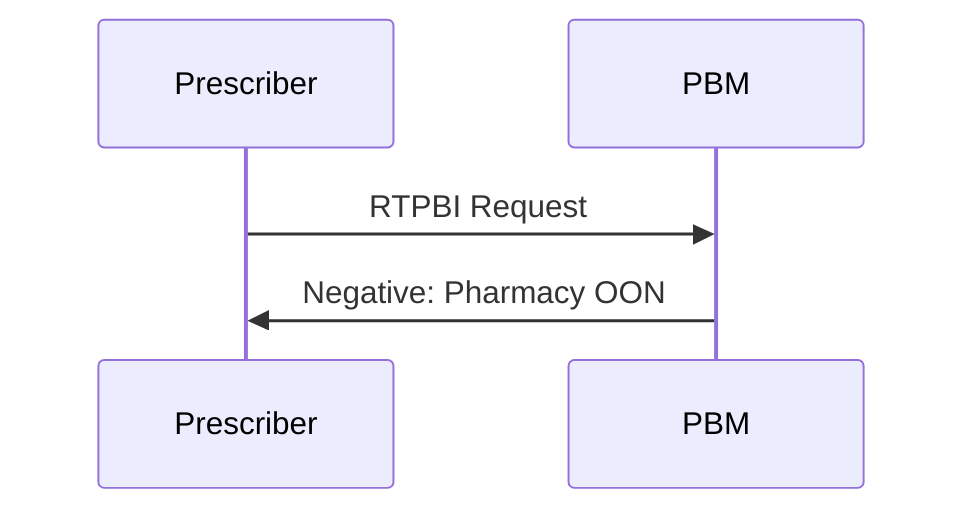

**Response:** Out-of-network pharmacy indicator. Optionally, in-network pharmacy alternatives.

### Use Case 9: Out-of-Network Provider

The prescriber (provider) is not contracted with the patient's plan. Medications written by this provider may not be covered, and the patient may need to choose a different prescriber.

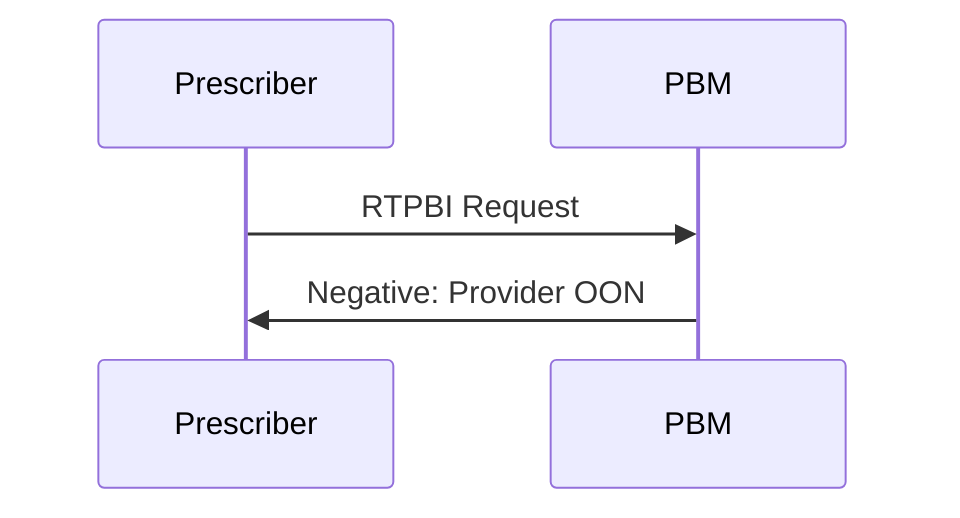

**Response:** Out-of-network provider indicator.

### Use Case 10: Patient Provider Lock-In

The patient is restricted to a specific provider or set of providers, often due to compliance concerns, fraud prevention, or abuse history. The response indicates that the current prescriber is not authorized to write for this patient.

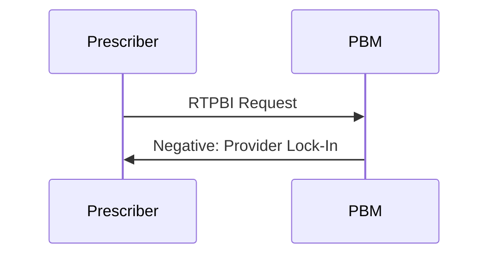

**Response:** Patient provider lock-in indicator. Optionally, the authorized provider(s).

### Use Case 11: Drug Utilization Evaluation (DUE) Alert

Based on the patient's claims history, the requested product would likely cause a conflict — therapeutic duplication, drug-drug interaction, over-utilization, or other DUR concerns. The prescriber is alerted so they can resolve the issue before prescribing.

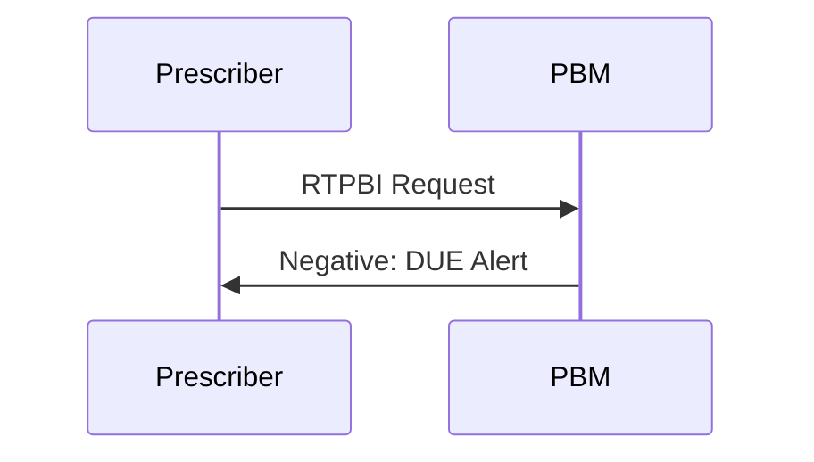

**Response:** DUE alert indicator with details about the conflict.

### Use Case 12: Restricted Pharmacy

The patient is required to use a specific pharmacy or type of pharmacy (e.g., a specialty pharmacy, a mandatory mail-order pharmacy, or a restricted network). The pharmacy identified in the request is not eligible to fill the prescription for this patient.

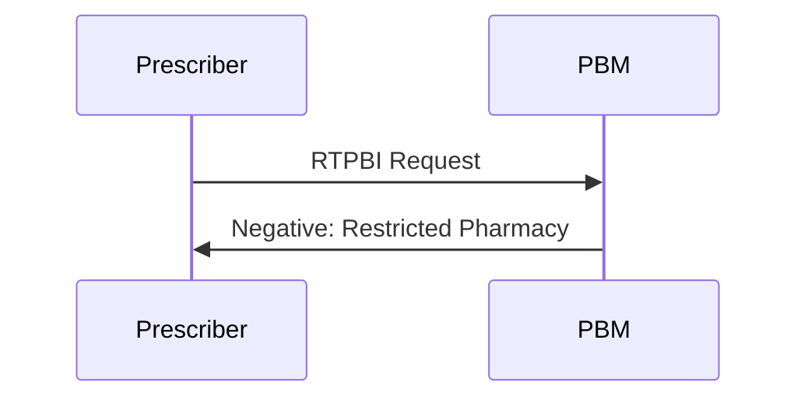

**Response:** Restricted pharmacy indicator. Optionally, the eligible pharmacy or pharmacy type.

## Use Case Summary

| # | Use Case | Type | Key Response Data |
|---|----------|------|-------------------|
| 1 | Patient eligible, product covered | Affirmative | Estimated patient financial responsibility |
| 2 | Patient not eligible | Negative | Eligibility denial only |
| 3 | Benefit exclusion | Negative | Exclusion indicator only |
| 4 | Formulary exclusion | Negative | Exclusion indicator; optionally, alternatives and cost |
| 5 | Coverage limits | Negative | Limit indicator; optionally, maximum quantity/supply |
| 6 | Step therapy required | Negative | Step therapy indicator; optionally, required prior drugs |
| 7 | Prior authorization required | Negative | PA required indicator (triggers ePA workflow) |
| 8 | Out-of-network pharmacy | Negative | OON indicator; optionally, in-network pharmacies |
| 9 | Out-of-network provider | Negative | OON indicator |
| 10 | Patient provider lock-in | Negative | Lock-in indicator; optionally, authorized providers |
| 11 | DUE alert | Negative | Alert indicator with conflict details |
| 12 | Restricted pharmacy | Negative | Restriction indicator; optionally, eligible pharmacies |

## Data Element Categories

Every data element in the RTPBI transaction is categorized as one of:

| Category | Description | Example |
|----------|-------------|---------|
| **Required** | Must always be included in the transaction | Patient information on a request |
| **Situational** | Required when specific conditions are met | Coverage limit details (required only if a coverage limit use case is triggered) |
| **Optional** | Included at the sender's discretion | Free-text message from the PBM with additional context |

## Request Structure

All RTPBI requests contain the same segments, regardless of the use case:

| Segment | Content | Required |
|---------|---------|----------|
| Routing Information | Switch/intermediary routing details | Yes |
| Payer Routing Information | PBM/payer identification for routing | Yes |
| Transaction-Specific Information | Transaction type, version, technical metadata | Yes |
| Patient Information | Patient demographics, identifiers | Yes |
| Prescription Information | Drug/product being contemplated | Yes |
| Pharmacy of Choice | The pharmacy the patient intends to use | Yes |
| Prescriber / Provider Information | Identifying the requesting prescriber | Yes |

## Response Structure

### Affirmative Response (Use Case 1 Only)

An affirmative response confirms the prescription can proceed and requires:

| Segment | Content | Required |
|---------|---------|----------|
| Routing Information | Switch/intermediary routing details | Yes |
| Transaction-Specific Information | Transaction metadata | Yes |
| Prescription Information | Echoed back from the request | Yes |
| Estimated Patient Financial Responsibility | Patient cost share | Yes |

Additional information (e.g., mail-service pharmacy options) may be included at the PBM's discretion (situational or optional).

### Negative Response (Use Cases 2–12)

All negative responses require:

| Segment | Content | Required |
|---------|---------|----------|
| Routing Information | Switch/intermediary routing details | Yes |
| Transaction-Specific Information | Transaction metadata | Yes |
| Prescription Information | Echoed back from the request | Yes |
| Reject / Denial Explanation | The reason for the negative response | Yes |

The reject/denial explanation varies by use case but is always present on a negative response.

Additional segments on a negative response are optional and depend on the use case:

| Segment | When Used |
|---------|-----------|
| Financial Information | Total financial responsibility (required); detail is situational/optional |
| Coverage Limits | Optional unless the use case requires it |
| Drug Utilization Evaluation Information | Optional — for DUE alert use case |
| Alternative Pharmacy | Optional — for out-of-network or restricted pharmacy use cases |
| Lock-In Provider | Optional — for provider lock-in use case |
| Alternative Formulary Products | Optional — for formulary exclusion use case |
| Free-Text Message | Optional — at the PBM's discretion |

## Out of Scope

The initial version of the RTPBI standard explicitly excludes:

| Exclusion | Reason |
|-----------|--------|
| Inquiries from patients (non-providers) | RTPBI is a prescriber-facing transaction |
| Actual or estimated cost to the payer | Only patient cost share is in scope |
| Subscriber identification | Only patient identification is included |
| Coordination of benefits | Too complex for the initial standard |
| Medication therapy management (MTM) services | Separate transaction type |
| Partial fills | Separate transaction type |
| Compounds | Separate transaction type |

These exclusions may be revisited in future versions of the standard.

## Relationship to Other NCPDP Standards

### NCPDP Telecom Standard (B1/B2)

The telecom standard governs pharmacy-to-PBM claims (B1) and reversals (B2). RTPBI is a **prescriber-to-payer** transaction that happens **before** the pharmacy claim. It is a separate standard with a separate workflow.

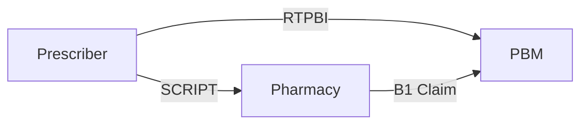

### NCPDP SCRIPT Standard

SCRIPT is the e-prescribing standard for transmitting prescriptions from prescriber to pharmacies. RTPBI is a separate transaction, but the two are designed to work together in the prescriber's workflow:

1. **RTPBI** — Prescriber queries benefit information (is this drug covered?)
2. **ePA (electronic Prior Authorization)** — If prior authorization is required, initiate it (part of SCRIPT)
3. **SCRIPT** — Prescriber transmits the prescription to the pharmacy

RTPBI may eventually become part of the SCRIPT suite of transactions, but the technical structure (EDI, XML, or FHIR) has not yet been determined.

### Batch Formulary and Benefit Standard

The existing NCPDP batch formulary standard provides general formulary and benefit information to EHRs but is not real-time and not patient-specific. RTPBI addresses these gaps by providing point-in-time, patient-specific benefit information.

## Benefits

| Benefit | Description |
|---------|-------------|
| **Informed prescribing** | Prescribers can verify coverage, restrictions, and cost before writing a prescription |
| **Reduced prescription abandonment** | Patients who know their cost up front are more likely to pick up their medication |
| **Improved medication adherence** | When cost and coverage are addressed at the point of care, patients are more likely to commit to therapy |
| **Fewer pharmacy callbacks** | Issues like prior authorization and formulary exclusions are resolved before the prescription reaches the pharmacy |
| **Better patient-provider discussion** | Real-time cost and coverage information enables meaningful conversations about drug choice and pharmacy selection |

## Estimated vs. Guaranteed Cost

RTPBI provides an **estimated** patient financial responsibility, not a guaranteed amount. Two factors contribute to this:

1. **Time gap** — Between the RTPBI inquiry and the actual pharmacy claim, other claims may change the patient's accumulator (deductible, out-of-pocket maximum, etc.)
2. **Product uncertainty** — The prescriber may use a representative NDC, but the pharmacy may dispense a different NDC (different package size, manufacturer, etc.)

The goal is to provide the best possible estimate, but the final cost is determined at the point of sale when the pharmacy submits the B1 claim.

---

*Source: NCPDP Real-Time Prescription Benefit Inquiry Task Group webinar (2016), use case document, and business requirements.*